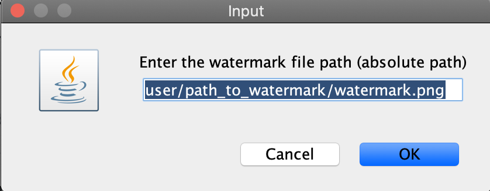

# Multi Photo Watermaker
 
Open source program for watermarking a whole entire folder of images for free. Works with png, jpg, gif, and most other image formats.

## Example

The watermark will be applied to every photo in the folder, and the resulting images will be printed back in the old folder perserving the inital photos. 

To get the file/folder location on mac, you can drag the file into terminal and it will show the absolute path. In windows it can be found by right clicking the folder/image and selected properities. 

# Implementation 

Java was the only language used in this program. Gui was made using swing and the program was tested using JUnit. 

# Configuration File

The configuration file is used for testing and as an alternative to GUI input. It has three variables: watermarkLocation, validImageFolderPath, and validImagePath. validImagePath is only used to test Photo.java, and that test is found in the testing package in the class PhotoTest.java.

# Features that could be added

Drag and drop functionality for both the folder/watermark would make this a much better project. Also figuring out a way to make the GUI look better would be great. Additionally, hosting it on a webpage would make the project more accessible. 
